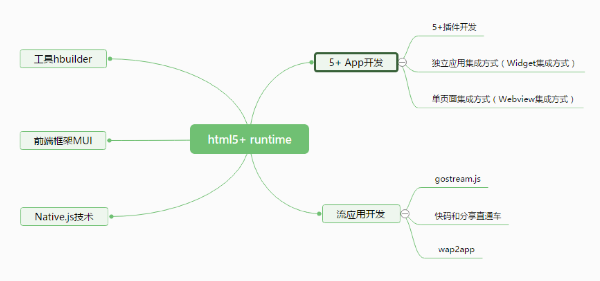

讲座：[html5+ App开发工程化实践之路](https://segmentfault.com/l/1500000009542402/play)

# html5 + app开发的优势和基本概念

基于html5+ runtime，工具层：hbuilder, 前端框架MUI，native.js

# MUI 框架学习指南

官方文档：[http://dev.dcloud.net.cn/mui/](http://dev.dcloud.net.cn/mui/)

学习思路：
1. 组件——大部分组件提供了h5版本和原生版本
2. 窗口——核心内容是 webview/native view
3. 事件——事件绑定/事件触发/手势事件/自定义事件
4. AJAX——数据请求

# html5+ 规范核心API详细讲解

规范地址：[http://www.html5plus.org/doc/h5p.html](http://www.html5plus.org/doc/h5p.html)

1. Webview —— 窗口管理
  1. WebviewObject
  2. WebviewStyles
2. XMLHttpRequest / Uploader
3. NativeObj / subNview

# html5+ 脚手架 plus-cli 发布

# html5+ App 优化方案

# 基于html5+ 标准的流应用开发